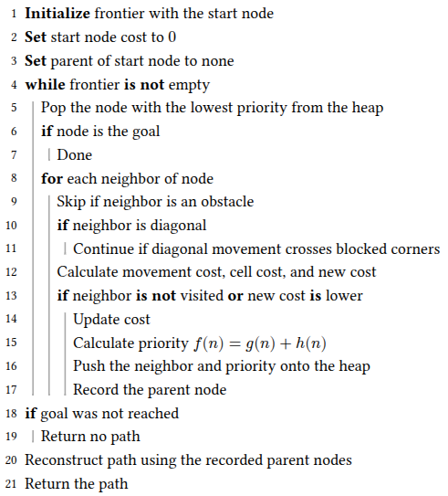
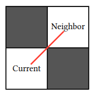
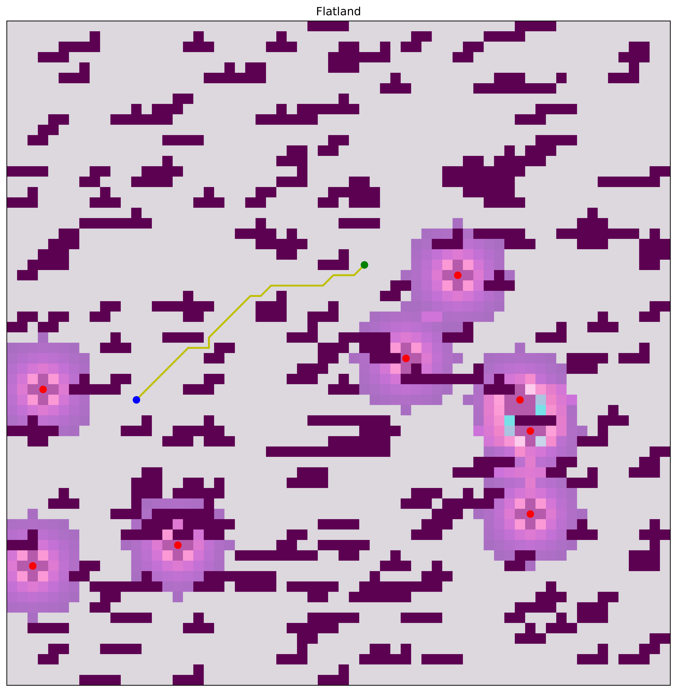
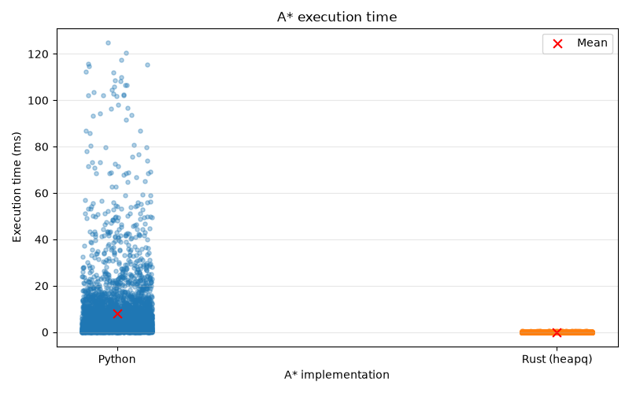
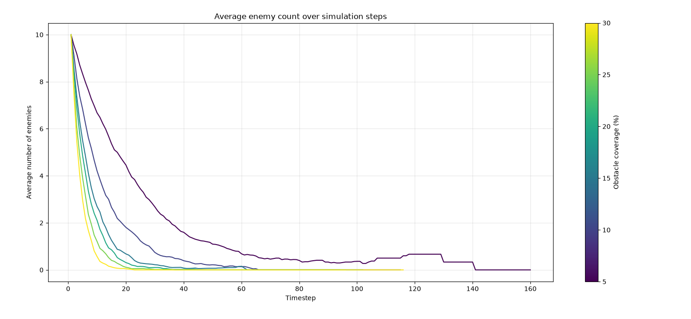
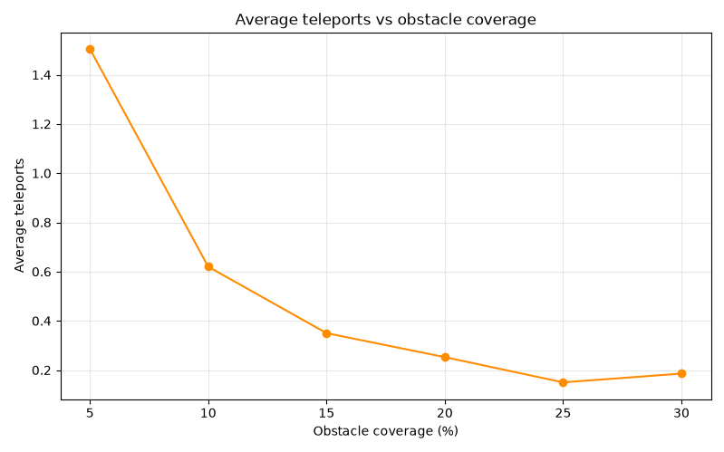

<div class="post-meta-bar">
  
  
</div>

<script type="module">
	import mermaid from 'https://cdn.jsdelivr.net/npm/mermaid@10/dist/mermaid.esm.min.mjs';
	mermaid.initialize({
		startOnLoad: true,
		theme: 'dark'
	});
</script>

## Introduction
Flatland is a 2D simulation where a point robot hero must navigate a randomly generated grid world and reach a goal point without being defeated by enemies. It is a discrete time simulation that updates the position of all entities, checks for collisions, and renders the updated environment using Matplotlib each time a step is taken. In my version, the goal is a green dot, the hero a blue dot, and enemies are red dots.

## System Architecture
My Flatland solution is composed of a few core functions spread across multiple files. I am well aware that I should have taken a more object oriented approach to this project. The software engineer in me also cringes quite a bit when thinking about how this was implemented. I do have plans to refactor the base simulation setup and rendering logic in order to increase reusability for future projects.

<pre style="text-align: center" class="mermaid">
flowchart TD
    title["<b>main.py</b>"]
    parse["Parse arguments"]
    init["Initialize simulation"]
    
    field["Create field"]
    positions["Create positions"]
    costmap["Build costmap"]
    
    planner["Planner"]
    update["Update frame"]
    move["Move entities + costmap update"]
    check["Check game state"]
    decision{"Game over?"}
    
    done["Simulation ends"]
    running["Still running"]

    %% Main Flow
    title --> parse
    parse --> init

    %% Parallel Initialization
    init --> field
    init --> positions
    init --> costmap

    %% Convergence to Planner
    field --> planner
    positions --> planner
    costmap --> planner

    %% Game Loop
    planner --> update
    update --> move
    move --> check
    check --> decision

    %% Decision Branches
    decision -->|Yes| done
    decision -->|No| running

    %% Loop back from Still Running to Planner
    running --> planner

</pre> 
<p style="text-align: center;"><strong>Figure 1:</strong> System behavior flowchart</p>


The program is run by running `main.py` which triggers an initialization sequence where the base plot is created, obstacles are generated and the goal, start, and enemy locations are determined. After initializing all components, a update loop is entered where planning, collision checking, and rendering occur until either the hero reaches the goal, and enemy stops a hero, or the hero cannot get a path to the goal within five teleports.


### The World
The world is represented as a 2D grid or NumPy array of adjustable size thanks to the `--size` argument that can be passed upon starting the program. The default size of the grid is 64x64 and contains a specific percentage of obstacles (adjustable by using `--coverage`) created by basic shape which are very Tetris-like.

There are actually many parameters that can be adjusted to get different and interesting results:

| **Argument** | **Short form** | **Type** | **Default** | **Description** |
| :--- | :--- | :--- | :--- | :--- |
| `--coverage` | `-c` | `float` | `20.0` | Percentage of the field covered by obstacles |
| `--seed` | `-r` | `int` | `None` | Random seed for reproducible games |
| `--speed` | `-ms` | `int` | `500` | Animation update interval in milliseconds |
| `--size` | `-s` | `int` | `64` | Width and height of the square grid |
| `--version` | `-v` | `str` | `"py"` | Path planner implementation: `py` or `rs` |
| `--enemies` | `-e` | `int` | `10` | Number of enemies |
| `--headless` | | `flag` | `False` | Run without displaying the Matplotlib window |
| `--data` | | `flag` | `False` | Enable JSON game-state logging |
| `--frames` | | `int` | `1000` | Number of frames to run in headless mode |
{: style="margin: 0 auto; display: table; width: auto;"}

<p style="text-align: center;"><strong>Table 1:</strong> Configurable simulation settings</p>


### Enemies
Enemy behavior is decided first by passing an argument saying how many enemies should be initialized (`--enemies`) with a default setting of 10. Upon initialization, enemies are randomly placed in free cells on the grid after the map is created and the positions are represented as a list of tuples. The enemies currently only consider the hero when selecting their next position. This means that they can collide with obstacles and become part of the grid. This behavior is applied by first looping through each of the eight surrounding grid cells surrounding each enemy and ranking them based on Euclidean distance to the hero's location.

```py
for row, column in enemies:
    candidates = []

    # loop through neighbors of 8 
    for row_change in (-1, 0, 1):
        for column_change in (-1, 0, 1):
            if row_change == 0 and column_change == 0:
                continue

            new_cell = [row + row_change, column + column_change]

            # make sure new cell is in map bounds
            if (0 <= new_cell[0] < field.shape[0] and 0 <= new_cell[1] < field.shape[0]):
                dist = np.linalg.norm(hero - new_cell) # distance to hero from new cell 
                candidates.append((dist, new_cell[0], new_cell[1]))

    if not candidates:
        updated.append([row, column])
        continue

    _, new_cell[0], new_cell[1] = min(candidates) # lowest distance is chosen
```

After the next cell is determined, it's value is checked and if it is an obstacle, the current cell an enemy is on also becomes an obstacle.
```py
 if field[new_cell[0], new_cell[1]] != 0:
            field[row, column] = 100
            continue
```

If I had more time to work on this project, I would have included an adjustable probability that an enemy survives or avoids a collision in order to make the game more interesting.

## Path Planner Implementation
I was incredibly boring and about as basic as I could be with my solution for the hero's planner. It was noticed that most enemies turn into static obstacles fairly early in the simulation when the coverage is set to 20%. However there was the odd simulation or two where obstacles were generated in a way that an enemy had a direct path to the hero. Implementing a costmap later on helped reduce the amount of hero deaths.

<div align="center">
  
</div>
<p style="text-align: center;"><strong>Figure 2:</strong> A* Psuedocode</p>

The key A\* priority is $f(n) = g(n) + h(n)$, where $g(n)$ is the accumulated cost of reaching the current cell, including both movement and cell costs, and $h(n)$ is the Euclidean distance from the current cell to the goal. The node with the lowest $f(n)$ value is selected next, balancing the cost already incurred with the estimated cost of reaching the goal.

### Diagonal Wall Condition
One thing that was noticed and led to the pseudocode step "Continue if diagonal movement crosses blocked corners" after testing out the planner for the first time was how the hero would cut between two diagonal obstacles. In my opinion, if two obstacles (`grid[cell] == 100`) are diagonal, there should not be a way to pass through that wall to the open diagonal cell.

<div align="center">
  
</div>

<p style="text-align: center;"><strong>Figure 3:</strong> Example of a "diagonal wall".</p>


In order to resolve this bug, an additional check was added into the planner code to make sure the neighboring cells to a diagonal move were not obstacles. The code snippet below shows the python implementation of this logic. 

```py
  row_change = neighbor[0] - current[0]
  column_change = neighbor[1] - current[1]
  is_diagonal = row_change != 0 and column_change != 0

  if is_diagonal:
      vertical_blocked = np.isinf(grid[current[0] + row_change, current[1]])
      horizontal_blocked = np.isinf(grid[current[0], current[1] + column_change])

      if vertical_blocked or horizontal_blocked:
          continue
```

### Costmap
In order to be victorious even in those few odd cases, A costmap was implemented to inform the hero of moves that are considered to be higher risk. This was done by making a second layer over the original map and increasing the cost of the cells that were within a specific radius of each enemy.

<div align="center">
  
</div>

<p style="text-align: center;"><strong>Figure 4:</strong> Enemies with areas of increased cost around them</p>


As seen in the figure above, the areas surrounding enemies are colored in shades of purples and pinks (I took inspiration from the Navigation2 / Rviz2 color scheme). The closer a cell is to an enemy, the higher it's cost is. In order to keep complete obstacle avoidance, all of the non-zero cells in the initial map are assigned a value of `np.inf`. 

### "Rewrite it in Rust"
Over the summer I was a software engineering intern (and now work there part-time) at a consulting company called Boston Engineering. During this time I worked on autonomous marine robots which all used the ROS Python client library (rclpy). After being there for a month or so, I was pulled on to another project which was a commercial internet of things (IoT) device whose codebase was being completely written in Rust. I had not written any Rust prior to that experience and then had to spend numerous hours completing the Rustlings tutorials, which led me to start using it for other small projects and later this assignment.

Conceptually, my Rust planner implementation is a translation of my Python one. It is just written in a compiled language instead of an interpreted one so the execution time is *much* faster. I also learned how to use Maturin and PyO3 to add python bindings into my Rust code so I could reuse my simulation environment and not have to rewrite anything. 

<div align="center">
  
</div>
<p style="text-align: center;"><strong>Figure 5:</strong> Execution time for Python and Rust planners</p>

| Version | N | Mean (ms) | Median (ms) | Min (ms) | Max (ms) | Std dev (ms) |
| :--- | ---: | ---: | ---: | ---: | ---: | ---: |
| Python | 4144 | 7.9358 | 3.4891 | 0.0237 | 124.9164 | 13.6360 |
| Rust (heapq) | 4144 | 0.0430 | 0.0214 | 0.0036 | 0.7112 | 0.0650 |
{: style="margin: 0 auto; display: table; width: auto;"}
<p style="text-align: center;"><strong>Table 3:</strong> Statistics for both planner implementations</p>

In order to get the data to make both of the plots above, I ran 100 trials of each planner at 20% obstacle coverage, iterating through random seeds so that each planner would be tested in the same 100 environments. It is no surprise that Rust is much faster than Python due to how one is an interpreted language and the other is complied. I find it very interesting (although it was somewhat expected) that Python's slowest path (124ms) took nearly 17,700% longer than Rust's (0.7ms). One test I did not have time to do was compare different versions of the Rust implementation. When I complied the rust part of the project, I had to use a `--release` flag to specify that I wanted the result to be optimized. I wonder how unoptimized Rust would stack up against Python.

There are slight technical differences with the data structures used in the Rust algorithm and how popping and inserting nodes works. Similarities of the two planners include the algorithm itself, heuristics, movement, cell costs, how infinite cells are interpreted and being aware of the diagonal wall condition.

| Feature | Python | Rust |
| --- | --- | --- |
| **Priority queue** | `heapq` | `PriorityQueue` |
| **Cost storage** | Dictionary | Vector |
| **Parent storage** | Dictionary | Vector |
| **Closed set** | No explicit set | Yes |
| **Grid indexing** | `(row, col)` dictionary keys | Flattened array index |
| **Bounds checking** | Mostly implicit | Explicit |
| **Python integration** | Native | PyO3 |
{: style="margin: 0 auto; display: table; width: auto;"}
<p style="text-align: center;"><strong>Table 4:</strong> Python vs. Rust A* implementation details</p>

The main difference is that I ended up using `heapq` in the python version while using `PriorityQueue` for the Rust algorithm. They do fundamentally the same thing, but require different uses of data structures.

For example, in Python, I directly store the priority as shown below:
```py
heapq.heappush(frontier, (priority, neighbor))
```

In the Rust function, the priority is associated with each grid cell (node) through the scoring function:
```rs
let min_heap_score = Box::new(move |node: &Node| {
    Reverse(OrderedFloat(node.f_cost))
});
```

## Results
It was noted pretty early on the the enemies were not very good at defeating the hero at 20% obstacle coverage. I was curious how obstacle coverage effected how many time steps enemies stuck around to challenge the hero point robot. In the future, I think it would be interesting to make the enemies a little bit smarter and see how the numbers change. All trials run were run using a data generation script (`trials.py`) and logging system I built (`game_logger.py`) which stores the game state in a JSON string until it is ready to be visualized by a function in `plotting.py`.

<div align="center">
  
</div>
<p style="text-align: center;"><strong>Figure 6:</strong> Number of enemies per timestep</p>

<div align="center">
  
</div>
<p style="text-align: center;"><strong>Figure 7:</strong> Average number of teleports used in 100 games per percent coverage</p>

It makes sense that less teleports would be needed as the coverage increases since enemies do not last as long in Flatland games with a higher percent obstacle coverage.

## Other Information
A table of the external libraries I used, links to my GitHub repository, and other cool things can be found in this section.

### Source Code
Link to GitHub: [kymadogg/flatland](https://github.com/kymadogg/flatland). This time I also tagged my final version and made a release to avoid errors from appearing (i.e. me pushing code to main and forgetting it is not instantly graded).

### External Libraries
A variety of external libraries were used to prevent me from developing my own graphics library among other things. I chose ones that I was already familiar with in order to get the environment up quickly so I could focus on the implementation of the hero and enemy behavior. 

### Python
* *[NumPy](https://numpy.org/)* - Numerical arrays, random generation, and grid data.
* *[Matplotlib](https://matplotlib.org/)* - Game visualization and animation.
* *[Colorama](https://pypi.org/project/colorama/)* - Colored terminal output.
* *[Notify2](https://pypi.org/project/notify2/)* - Desktop notifications for trial runs.
* *[dbus-python](https://pypi.org/project/dbus-python/)* - D-Bus integration used by desktop notifications.
* *[Maturin](https://www.maturin.rs/)* - Builds and installs the Rust-based Python extension.

### Rust
* *[PyO3](https://pyo3.rs/)* - Creates Python bindings for the Rust (`src/planner.rs`) code.
* *[rust-numpy](https://github.com/PyO3/rust-numpy)* - Accesses NumPy arrays from Rust.
* *[ordered-float](https://crates.io/crates/ordered-float)* - Provides ordering for floating-point values in the priority queue.
* *[heapq](https://crates.io/crates/heapq)* - Priority queue implementation for the Rust A* planner.